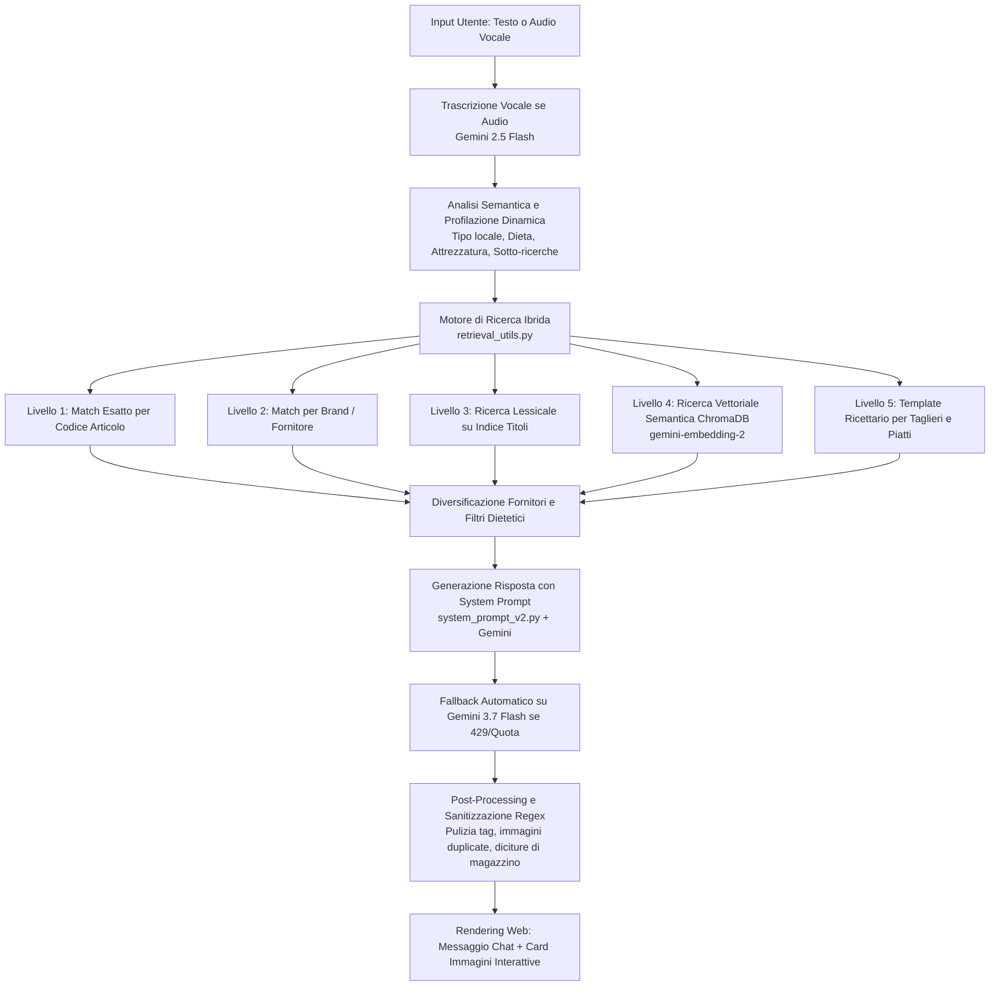

# 🍽️ Nino - Consulente Commerciale B2B So Food

Assistente virtuale intelligente basato su architettura **RAG (Retrieval-Augmented Generation)**, **ChromaDB** e i modelli multimodali **Google Gemini**.  
Nino opera come consulente commerciale per **So Food** (distributore alimentare di eccellenza con sede a Bari), supportando chef, ristoratori, gestori di bistrot, pizzerie, hamburgherie e bar nella scelta delle referenze, nella composizione di menù e nella valorizzazione dei prodotti a catalogo.

---

## 🎯 1. Obiettivi del Progetto

1. **Consulenza Gastronomica e Commerciale B2B**:
   - Assistere i professionisti dell'Ho.Re.Ca. con un tono consulenziale, caloroso e autorevole.
   - Guidare il ristoratore nella composizione di proposte gastronomiche complete: taglieri di salumi e formaggi, primi piatti, secondi, hamburger gourmet, aperitivi e dessert.
   - Suggerire formati professionali (HORECA, secchielli, latte da 1-3 kg, preaffettati skin/vaschetta).

2. **Fidelizzazione e Coerenza al Catalogo Reale**:
   - Proporre **esclusivamente** referenze presenti nel catalogo So Food, evitando qualsiasi allucinazione di fornitori o marchi esterni.
   - Fornire per ogni prodotto consigliato una visualizzazione immediata con card, immagini (`[IMG: codice]`), marca e note di servizio.

3. **Interfaccia e Accessibilità Multicanale**:
   - Web App interattiva in stile WhatsApp con supporto vocale (Speech-to-Text).
   - Interfaccia CLI da terminale per test rapidi o automazioni.
   - Possibilità di esposizione pubblica online con un clic tramite tunnel Cloudflare.

---

## 🧠 2. Come Funziona il Bot: Architettura e Pipeline RAG

Il flusso operativo da quando l'utente invia una richiesta a quando riceve la risposta si articola in 5 fasi:



### Dettaglio delle Fasi:

1. **Input & Trascrizione Audio**:
   - In caso di vocale, `trascrivi_audio()` invia il flusso audio a `models/gemini-2.5-flash` con filtri anti-eco e rilevamento del silenzio.
2. **Analisi Semantica & Profilazione Locale (`analizza_richiesta_e_profila`)**:
   - Estrae vincoli di contesto: tipologia di locale (pesce, pub, pizzeria, trattoria), vincoli dietetici (vegano, vegetariano, celiaco), attrezzature (con/senza affettatrice), e scompone richieste complesse in sotto-ricerche mirate.
3. **Ricerca Ibrida Multi-Livello (`retrieval_utils.py`)**:
   - **Codice Esatto**: intercetta codici prodotto (es. `PC3952`, `CP00001`, `OBCR`) mappati in memoria all'avvio.
   - **Brand / Fornitore**: intercetta marchi e produttori usando un dizionario di sinonimi ed alias (`_ALIAS_FORNITORI`).
   - **Lessicale su Titoli**: ricerca per corrispondenza esatta delle parole chiave sul catalogo.
   - **Vettoriale Semantica**: genera il vettore della query con `models/gemini-embedding-2` e interroga la collezione ChromaDB (`catalogo_sofood`), escludendo reparti logistici o schede aziendali.
   - **Composizione da Ricettario**: se la richiesta riguarda un piatto composto o tagliere, carica i template strutturati dalla collezione `ricette_sofood`.
4. **Generazione della Risposta**:
   - Invia la cronologia della conversazione e i dati estratti dal catalogo al modello linguistico con il prompt `SYSTEM_PROMPT_NINO`.
   - Se il modello primario esaurisce la quota o riceve un errore `429 RESOURCE_EXHAUSTED` / `503`, subentra all'istante il modello di fallback.
5. **Post-Processing e Pulizia (`testo_pulito`)**:
   - Rimuove prefissi ridondanti nei titoli in grassetto (es. `**Brand - Prodotto**` -> `**Prodotto**`).
   - Elimina packaging non commerciali dai titoli (es. `Sottovuoto`, `S/V`, `ATM`).
   - Converte refusi fonetici noti (es. *"sottofondo"* -> *"sottovuoto"*).
   - Elimina tag immagine duplicati o consecutivi (`[IMG: ...] [IMG: ...]`).

---

## 🔍 3. Problematiche Riscontrate nei Test e Soluzioni Adottate

Durante i test e le simulazioni multi-turno sono emerse diverse criticità ricorrenti, risolte con specifici interventi architetturali e di prompt engineering:

| Criticità Riscontrata | Causa Radice | Soluzione Applicata |
| :--- | :--- | :--- |
| **Allucinazione del fornitore "Afeltra"** | Il modello citava spontaneamente il pastificio Afeltra (inesistente a catalogo So Food). | Bonifica completa del codice e del prompt di sistema. Nel catalogo reale esistono solo: **Pastificio Gentile** (secca di Gragnano IGP), **Casa Prencipe** (fresca biologica del Gargano) e **Pasta Marilungo** (all'uovo). |
| **Sugo pronto scambiato per Pasta pura di pistacchio** | La parola "pasta" nei semilavorati per pasticceria/gelateria (es. *Pasta Pura 100% Pistacchio di Evergreen*) veniva associata a condimenti per pasta. | Introdotta una regola esplicita in `retrieval_utils.py` che esclude semilavorati dolci/frutta secca quando l'utente cerca primi piatti o condimenti salati. |
| **Conserve vs Sughi Pronti** | I pomodori datterini in barattolo (in acqua di mare o al naturale di Così Com'è) venivano proposti come sughi pronti senza cottura. | Distinzione netta tra conserve/pomodori base e veri sughi pronti all'uso (*Così Com'è* basilico `PC3952`, arrabbiata `PC3954`; *Casa Marrazzo* San Marzano `CO1131`). |
| **Deviazione fuori contesto (es. Carne in Ristorante di Pesce)** | Alla richiesta di altri antipasti per un ristorante ittico, il bot consigliava una tartare di manzo per "ospiti alternativi". | Regola di coerenza vincolante nel prompt: vietato proporre carne o derivati di terra a locali di mare o vegani/vegetariani a meno di esplicita richiesta del cliente. |
| **Monotematicità nei Menu Vegani/Completi** | Ripetizione dello stesso ingrediente (es. datterini sia nel condimento del primo che come secondo/contorno). | Regola di varietà cromatica e merceologica: nel secondo piatto vegano obbligo di proporre proteine vegetali reali (*Casa Marrazzo* ceci, lenticchie, fagioli) o verdure (*Di Tria*). |
| **Tag Immagine Duplicati** | In presenza di risposte articolate, il bot generava tag `[IMG: CODICE]` doppi o consecutivi, appesantendo la chat. | Regex di deduplicazione al post-processing: `re.sub(r'(\[IMG:\s*[^\]]+\])(?:\s*\1)+', r'\1', testo_pulito)`. |
| **Linguaggio di magazzino ("Primo Prezzo")** | Il bot leggeva dai titoli interni diciture come *"Pesce Spada Affumicato Primo Prezzo"* e le usava con il cliente. | Istruzione al bot di presentare i prodotti con stile commerciale nobile, omettendo sigle contabili o da listino grossista. |
| **Limiti di Quota API (429 Resource Exhausted)** | Saturazione improvvisa della quota sul modello Gemini selezionato. | Configurazione dinamica dei fallback: `gemini-3.5-flash-lite` come motore principale leggero e scattante, con subentro immediato su `gemini-3.7-flash` al verificarsi di errori 429. |
| **Conflitto interprete Python su Windows** | Tentativi di avviare il bot richiamando il Python globale 3.14 invece dell'ambiente virtuale (`.venv`). | Creazione dello script batch `avvia_bot.bat` che garantisce l'avvio con l'interprete virtuale corretto. |

---

## 📂 4. Cosa Fa Ogni File nel Progetto

### 🚀 Core dell'Applicazione e Interfaccia
* **`app.py`**:  
  Cuore del sistema server. È un'applicazione Flask che gestisce:
  - L'interfaccia grafica web in stile chat WhatsApp (`HTML_TEMPLATE`).
  - L'endpoint `/chat` per i messaggi testuali e `/chat_audio` per i messaggi vocali.
  - La gestione delle sessioni utente (`sessioni`), della memoria a breve termine e del salvataggio automatico delle chat in `log/chat/`.
  - La catena di analisi semantica e il fallback resiliente tra i modelli linguistici Gemini.
* **`main_chatbot_v2.py`**:  
  Versione a riga di comando (CLI) del chatbot. Utile per testare rapidamente le risposte da terminale, eseguire simulazioni o dialogare direttamente senza avviare il server web.

### 🔎 Recupero Dati e Intelligenza RAG
* **`retrieval_utils.py`**:  
  Motore di ricerca ibrida del catalogo. Contiene le funzioni di indicizzazione in memoria, ricerca esatta su codice (`trova_match_esatti_per_codice`), lookup su brand e alias (`trova_match_per_fornitore`), ricerca lessicale (`trova_match_lessicale`), ricerca semantica su ChromaDB (`ricerca_vettoriale`) e composizione da ricettario (`componi_proposta_da_ricettario`). Applica anche filtri dietetici e vincoli merceologici.
* **`system_prompt_v2.py`**:  
  Definisce il prompt di sistema (`SYSTEM_PROMPT_NINO`). Contiene l'identità di Nino, le linee guida di tono di voce B2B, l'elenco dei fornitori ufficiali per categoria, le regole per taglieri/menu, le linee guida dietetiche e le istruzioni per l'inserimento dei tag immagine `[IMG: codice]`.
* **`memoria_dinamica.txt`**:  
  File di memoria permanente caricato a ogni avvio e iniettato nel prompt. Raccoglie regole di abbinamento, correzioni commerciali e direttive operative apprese dai feedback storici.

### 📚 Tassonomia e Ricettario
* **`tassonomia_sofood.py`**:  
  Mappa gerarchica della struttura merceologica So Food (Reparto -> Categoria -> Sottocategoria).
* **`carica_ricettario.py`**:  
  Script che legge le schede ricetta e i piatti strutturati (da `filexlsx.py` o Excel) e li indicizza vettorialmente nella collezione ChromaDB `ricette_sofood`.
* **`filexlsx.py`**:  
  Dati grezzi strutturati contenenti i template di ricette e taglieri con ingredienti, ruoli e codici prodotto associati.
* **`Ricettario_SO_FOOD.xlsx`**:  
  Foglio di calcolo contenente le ricette codificate, i ruoli dei componenti del piatto e gli abbinamenti suggeriti.
* **`esporta_tassonomia_excel.py`**:  
  Script di utilità per esportare l'albero delle tassonomie in un foglio Excel leggibile per verifiche aziendali.

### 📦 Popolamento ed Ingestione Dati in ChromaDB
* **`caricaprodotti_v2.py`**:  
  Script principale per l'indicizzazione dei prodotti in ChromaDB. Genera gli embeddings multimodali (`gemini-embedding-2`) e memorizza metadati dettagliati per ogni referenza.
* **`carica_abstract_fornitori_v2.py`**:  
  Carica in ChromaDB le schede di presentazione e la filosofia produttiva dei singoli fornitori partner.
* **`carica_logistica_v2.py`**:  
  Carica nel database vettoriale le regole di consegna, i minimi d'ordine zonali e i dettagli operativi di magazzino.
* **`arricchisci_catalogo.py`**:  
  Pipeline di post-elaborazione che usa Gemini per analizzare le descrizioni dei prodotti e arricchirne automaticamente i metadati (sottocategorie, allergeni, note culinarie).
* **`aggiorna_immagine.py`** & **`aggiorna_san_salvatore.py`**:  
  Script di manutenzione mirata per correggere URL immagini mancanti o aggiornare specifici metadati di fornitore nel database vettoriale.

### 🛠️ Ispezione, Diagnostica e Addestramento
* **`ispettore_v2.py`**:  
  Strumento interattivo per ispezionare il database ChromaDB locale, effettuare query di test ed esaminare documenti e metadati archiviati.
* **`addestratore.py`**:  
  Script di test batch per simulare conversazioni, valutare la pertinenza delle risposte e ottimizzare le istruzioni di sistema.

### ⚡ Script di Avvio ed Esecuzione
* **`avvia_bot.bat`**:  
  Script batch per Windows. Con un semplice doppio clic attiva l'ambiente virtuale corretto (`.venv`) e lancia il server Flask su `http://127.0.0.1:5000`.
* **`avvia_tunnel.bat`**:  
  Avvia il binario `cloudflared.exe` per esporre istantaneamente il server locale a un URL pubblico sicuro HTTPS, permettendo di testare il bot da smartphone o inviarlo a clienti esterni.

### 📁 Directory Dati
* **`database_vettoriale/`**: Directory locale persistente di **ChromaDB** contenente le collezioni vettoriali indicizzate.
* **`log/chat/`**: Registro storico delle conversazioni salvate in formato JSON per tracciamento commerciale e audit.
* **`static/`**: Asset statici, icone e cartella `audio_uploads/` per la ricezione temporanea dei messaggi vocali inviati dal browser.

---

## 💻 5. Guida Rapida all'Avvio

### 1. Prerequisiti
- File `.env` presente nella cartella principale con la chiave valida:
  ```env
  GEMINI_API_KEY=AIzaSy...
  ```
- Ambiente virtuale Python con le dipendenze installate (`flask`, `chromadb`, `google-genai`, `python-dotenv`, `pydantic`).

### 2. Avviare il Server Web
- **Metodo rapido**: Doppio clic su `avvia_bot.bat`.
- **Da terminale PowerShell**:
  ```powershell
  .\.venv\Scripts\python.exe app.py
  ```
- Il bot sarà raggiungibile su: **`http://127.0.0.1:5000`**

### 3. Avviare la Versione Terminale (CLI)
```powershell
.\.venv\Scripts\python.exe main_chatbot_v2.py
```

### 4. Condividere il Bot Online (Tunnel)
Con `app.py` attivo in un terminale, apri un secondo terminale e lancia:
```powershell
.\avvia_tunnel.bat
```
Verrà generato un indirizzo pubblico sicuro `https://...trycloudflare.com` pronto da condividere.
