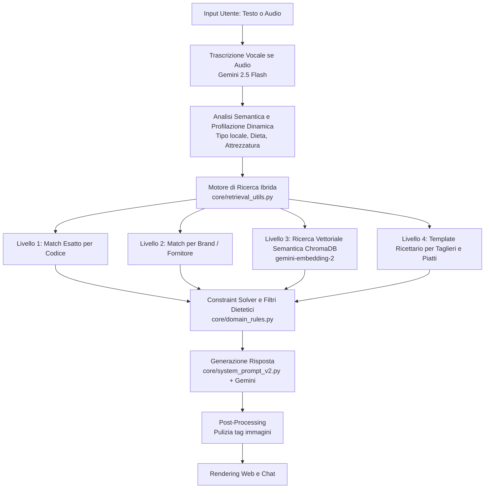

# 🤖 Assistente Virtuale "Nino" - So Food (Architettura RAG & Agentica)

Benvenuto nel repository del progetto **Nino**, l'assistente virtuale B2B di So Food basato su architettura RAG (Retrieval-Augmented Generation) e modelli Gemini.

## 🎯 1. Obiettivi del Progetto

Il sistema non è un semplice motore di ricerca, ma un **Consulente Commerciale Virtuale** in grado di ragionare e assistere i clienti del settore Ho.Re.Ca. e Retail. 

### Obiettivi Attuali (Raggiunti):
1. **Consulenza sui Singoli Prodotti:** Capacità di navigare l'intero catalogo So Food, descrivendo le referenze con tono professionale, fornendo immagini, caratteristiche e suggerimenti di utilizzo.
2. **Progettazione di Menu e Taglieri:** Capacità di ideare taglieri e piatti composti, rispettando vincoli dietetici (vegano, senza glutine), tematiche regionali e logiche di incompatibilità gastronomica.
3. **Logica da Consulente B2B:** Ragionare non come un software, ma come un agente di vendita esperto che profila il cliente (capisce se è una pizzeria o un ristorante stellato) e adatta le proposte (es. suggerendo formati convenienza per volumi alti o eccellenze artigianali per boutique).

### 🚀 Obiettivi Futuri (Roadmap):
- **Effettuare Ordini:** Integrazione con il gestionale per permettere ai clienti di inserire ordini direttamente via chat.
- **Stato Ordini e Tracking:** Possibilità per il cliente di chiedere "A che punto è la mia consegna di ieri?".
- **Marketing Proattivo:** Aggiornare i clienti su nuove linee di prodotti e inviare comunicazioni commerciali mirate (es. "Abbiamo appena inserito il nuovo prosciutto spagnolo, ti interessa un campione per il tuo locale?").

---

## 🧠 2. La Sfida Logica: Ragionare come un Consulente

La sfida più complessa del progetto non è estrarre testo, ma **insegnare a una macchina la logica commerciale e culinaria**. 

Il tutto è intimamente **collegato alle schede prodotto della repository PRODOTTI SOFOOD**. L'AI non "inventa" le ricette, ma legge i metadati reali estratti da ChromaDB.
I problemi affrontati durante lo sviluppo si concentrano su come far ragionare il bot con questi dati:

- **Constraint Solving (Incompatibilità):** Evitare che il bot proponga due prodotti della stessa famiglia (es. Salame e Finocchiona) in un singolo tagliere, ignorando la varietà necessaria per un piatto professionale. Questo ha richiesto l'introduzione di una *matrice di incompatibilità* (`domain_rules.py`).
- **Deviazioni Fuori Contesto:** Insegnare al bot che un ristorante di pesce non dovrebbe ricevere proposte di salumi di carne a meno di una richiesta specifica ("ospiti alternativi").
- **Bilanciamento del Menu:** Assicurare eterogeneità nei piatti composti. *(Stato attuale: implementato parzialmente tramite le matrici di famiglia merceologica; i controlli di texture puri come croccante/morbido non sono ancora strutturati a livello di metadati).*
- **Interpretazione del Formato:** Far comprendere al bot la differenza tra formati HORECA e RETAIL. *(Stato attuale: funzionante nella ricerca diretta tramite la profilazione del canale, ma in attesa di essere propagato alla pipeline di generazione automatica dei taglieri).*

---

## 🏗️ 3. Come Funziona il Bot: Architettura

Il flusso operativo si articola in 5 fasi tramite una pipeline intelligente:

---

## 📂 4. Struttura del Progetto

Per separare la logica del cervello dai compiti di routine, il progetto è diviso in pacchetti:

### 🧠 Modulo `core/` (L'Intelligenza)
Qui risiede tutta la logica decisionale e le regole di business:
* **`app.py` & `main_chatbot_v2.py`** (nella root): Il server web Flask (con interfaccia WhatsApp-style) e la controparte da terminale.
* **`system_prompt_v2.py`**: Definisce l'identità di Nino, le regole di tono di voce B2B e i vincoli generali.
* **`retrieval_utils.py`**: Il motore di ricerca ibrida e l'algoritmo di composizione dei taglieri.
* **`query_decomposer.py` & `agent_topology.py`**: L'architettura a nodi per scomporre le query complesse e classificare l'intento dell'utente.
* **`domain_rules.py`**: Matrici di incompatibilità per evitare abbinamenti scorretti (es. due salumi macinati).
* **`profilazione_locale.py` & `fornitori_config.py`**: Rilevamento del tipo di cliente (Horeca/Retail) e mappatura ufficiale dei marchi.

### ⚙️ Modulo `scripts/` (Manutenzione e Dati)
Questi file non girano durante le chat, ma servono per addestrare il bot e caricare i cataloghi:
* **`caricaprodotti_v2.py` & `carica_ricettario.py`**: Muli da soma per leggere i file Excel e indicizzarli vettorialmente in ChromaDB.
* **`carica_logistica_v2.py` & `carica_abstract_fornitori_v2.py`**: Per inserire regole di magazzino e filosofia dei produttori nel DB.
* **`arricchisci_catalogo.py`**: Pipeline per usare l'AI per autogenerare tag e categorie mancanti sui prodotti.
* **`ispettore_v2.py` & `addestratore.py`**: Tool per testare il DB offline e simulare chat per valutare le risposte.
* **`genera_tassonomia_sofood.py`**: Esportazioni e rigenerazione dell'albero delle categorie.

### 🗄️ Directory Dati
* **`database_vettoriale/`**: Database locale **ChromaDB** contenente le collezioni vettoriali (Prodotti, Ricette, Logistica).
* **`log/chat/`**: Registro storico JSON delle conversazioni.
* **`static/`**: Immagini, loghi e file audio temporanei.

---

## 🚀 5. Guida Rapida all'Avvio

### 1. Prerequisiti
- File `.env` con `GEMINI_API_KEY=AIzaSy...`
- Ambiente virtuale Python `(.venv)` attivato.

### 2. Avviare il Server Web
- **Rapido**: Doppio clic su `avvia_bot.bat`.
- **Terminale**: `.\.venv\Scripts\python.exe app.py`
- Aperto su: **`http://127.0.0.1:5000`**

### 3. Pubblicare il Bot Online
Lancia `avvia_tunnel.bat` per ottenere un link pubblico `https://...trycloudflare.com` condivisibile con i clienti.
