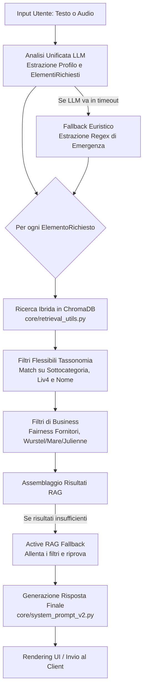

# 🤖 Assistente Virtuale "Nino" - So Food (Architettura RAG & Agentica)

Benvenuto nel repository del progetto **Nino**, l'assistente virtuale B2B di So Food basato su architettura RAG (Retrieval-Augmented Generation) e modelli Gemini.

## 🎯 1. Cosa fa il Bot e Casi d'Uso Utili

Il sistema non è un semplice motore di ricerca, ma un **Consulente Commerciale Virtuale** in grado di ragionare e assistere i clienti del settore Ho.Re.Ca. e Retail. 

### Usi Utili e Capacità:
1. **Esplorazione Mirata del Catalogo:** L'utente può chiedere prodotti specifici (es. *"dammi 2 prosciutti crudi di cui 1 di Parma"*) e il bot comprende le gerarchie, distinguendo tra richieste generiche e denominazioni specifiche grazie al motore di ricerca ibrida.
2. **Creazione di Taglieri e Composizioni:** Il bot è istruito per creare taglieri equilibrati. Se gli chiedi un tagliere di salumi e formaggi, scarta automaticamente prodotti fuori contesto (come wurstel, creme spalmabili, o formaggi tagliati a julienne) e garantisce varietà (es. alternando consistenze ed evitando troppi prodotti dello stesso fornitore).
3. **Profilazione del Cliente (Gestione Stato):** Il bot ha memoria della conversazione e deduce il profilo del cliente (es. ristorante stellato vs pub). Usa queste informazioni per filtrare i prodotti (es. formato Horeca vs Retail) e adattare il tono di voce.
4. **Filtri Dietetici e Allergie:** Capacità di applicare filtri rigidi (vegano, senza glutine, senza lattosio) scartando a priori i prodotti non idonei dal database vettoriale, prima ancora che l'LLM generi la risposta.

## 🏗️ 2. Come Funziona il Bot: L'Architettura Unificata

Il flusso operativo è stato recentemente ottimizzato in una **Pipeline Unificata** a chiamata singola per ridurre la latenza ed eliminare i bug della vecchia architettura a nodi. 

L'architettura è **RAG (Retrieval-Augmented Generation)**: l'intelligenza artificiale non inventa mai i prodotti. Li cerca nel database vettoriale (ChromaDB) tramite ricerca semantica e filtri esatti, estrae i metadati reali (fornitore, codice, allergeni, descrizione) e li "imita" nella sua risposta per sembrare umana e persuasiva.

## 📂 3. I File Principali (Sotto il Cofano)

Per separare la logica del cervello dai compiti di routine, il progetto è diviso in pacchetti:

### 🧠 Modulo Base e Core (L'Intelligenza)
* **`app.py`**: Il cuore dell'applicazione web (Flask). Gestisce:
  - Gli endpoint API (es. `/chat`).
  - L'`AnalisiUnificata`: il primo prompt LLM che scompone la frase dell'utente (es. "3 formaggi") in oggetti `ElementoRichiesto`.
  - Il **Fallback Euristico**: se l'API di Google va in crash (503), un sistema a espressioni regolari entra in azione per spezzare comunque la frase e garantire continuità.
  - L'**Active RAG Fallback**: se la ricerca trova pochi risultati (es. filtro troppo rigido), riprova automaticamente allentando i filtri.
  - I post-filtri di business (es. rimozione dei wurstel dai taglieri).
* **`core/retrieval_utils.py`**: Il motore di ricerca. Contiene la funzione vitale `cerca_prodotti()`, che esegue:
  - Match lessicale e vettoriale su ChromaDB.
  - Filtri tassonomici flessibili (`_match_sottocategoria`) per trovare denominazioni specifiche ("Parma", "San Daniele") anche quando nascoste nel livello 4 o nel nome del prodotto.
  - **Fairness Algorithm**: Impedisce a un singolo fornitore di monopolizzare i risultati raccomandati.
* **`core/system_prompt_v2.py`**: Il file di personalità. Definisce il prompt di sistema finale (`SYSTEM_PROMPT_NINO`), istruendo il bot su come formattare la risposta (uso di Markdown, elenchi puntati), su come parlare (tono B2B cordiale) e su come gestire i link alle immagini.
* **`core/domain_rules.py`**: Modulo storico che definisce matrici di incompatibilità e regole di dominio per la composizione vincolata di ricette pre-impostate.
* **`core/tassonomia_sofood.py`**: Mappatura Python dell'albero delle categorie merceologiche (ECR Grocery) per validare i reparti.

### ⚙️ Modulo `scripts/` (Manutenzione e Dati)
Questi script non vengono eseguiti durante la chat, ma servono per alimentare il cervello del bot:
* **`caricaprodotti_v2.py`**: Legge il catalogo (Excel), genera gli embedding vettoriali per ogni prodotto e li inietta nel ChromaDB.
* **`rigenera_tassonomia_db.py`**: Script di utilità per aggiornare massivamente i metadati tassonomici (livello 3 e livello 4) nel database vettoriale senza dover ricalcolare gli embedding.

### 🗄️ Directory Dati
* **`database_vettoriale/`**: Il database locale **ChromaDB**. È la "memoria a lungo termine" del bot, contiene i documenti e i vettori matematici per la ricerca semantica.
* **`static/`**: Contiene l'interfaccia frontend, il CSS stile-WhatsApp, loghi e script lato client.

## 🚀 4. Guida Rapida all'Avvio

### 1. Prerequisiti
- File `.env` con la chiave `GEMINI_API_KEY=AIzaSy...`
- Ambiente virtuale Python `(.venv)` attivato.

### 2. Avviare il Server Web
- **Metodo rapido**: Doppio clic su `avvia_bot.bat`.
- **Terminale (PowerShell)**: `.\.venv\Scripts\python.exe app.py`
- L'interfaccia sarà disponibile all'indirizzo: **`http://127.0.0.1:5000`**

### 3. Pubblicare il Bot Online (Tunneling)
Esegui `avvia_tunnel.bat` (che usa Cloudflared o simili) per ottenere un link pubblico HTTPS temporaneo, ideale per far testare il bot a clienti e colleghi dall'esterno.
