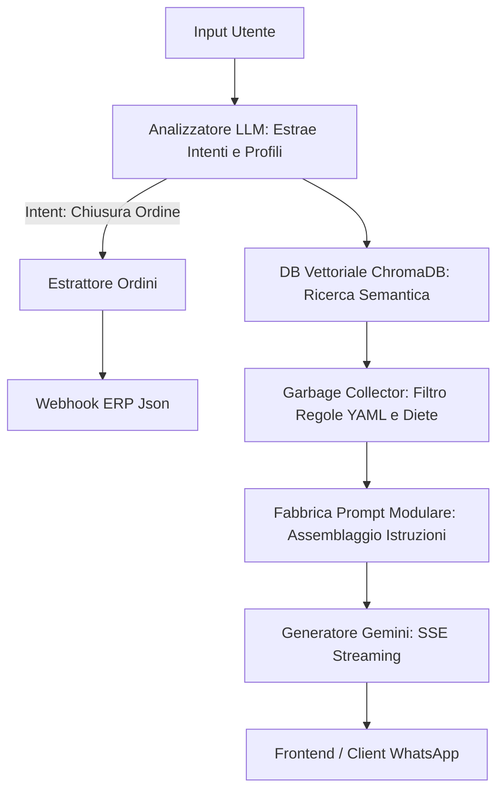

# 🤖 Assistente Virtuale Commerciale (Architettura SaaS RAG)

Benvenuto nel repository del progetto **Nino**, l'assistente virtuale B2B sviluppato per il settore della distribuzione alimentare (Ho.Re.Ca. e Retail). Il progetto è stato aggiornato a un'architettura **SaaS Multi-Tenant** basata su RAG (Retrieval-Augmented Generation) e modelli Gemini.

## 🎯 1. Cos'è e a cosa serve

Il sistema non è un semplice motore di ricerca, ma un **Consulente Commerciale Virtuale Proattivo**.

### Funzionalità Principali:
1. **Consulenza Proattiva (Funneling):** Invece di rispondere a richieste vaghe con lunghi elenchi, Nino fa domande mirate (es. *"Vuoi prodotti secchi da bancone o finger food caldi da friggere?"*) per guidare l'utente verso l'acquisto.
2. **Checkout e Carrello Conversazionale:** Permette all'utente di selezionare i prodotti semplicemente chattando. Quando l'utente decide di chiudere l'ordine (es. fornendo la Partita IVA), il sistema estrae dal contesto solo i prodotti confermati, validandoli come file JSON pronti per l'integrazione ERP (Webhook).
3. **Architettura Multi-Tenant (White-Label):** L'intero comportamento del bot (nome dell'azienda, settore, restrizioni logistiche, filtri dietetici globali) è gestito da un singolo file di configurazione (`regole_cliente.yaml`). Cambiando questo file, l'intelligenza artificiale diventa l'assistente di una nuova azienda, senza toccare una riga di codice Python.
4. **Compositore di Taglieri e Piatti:** Regole ferree impediscono al bot di inserire wurstel economici o salse scadenti su un tagliere di alta gamma. Il bot compone autonomamente menu bilanciati.
5. **Streaming SSE (Server-Sent Events):** Per prevenire i classici errori di Timeout HTTP sulle reti mobili o API esterne (es. WhatsApp), le risposte vengono inviate al client *in tempo reale, parola per parola*, mantenendo viva la connessione.

## ⚙️ 2. Come Funziona l'Architettura

Il flusso operativo usa una pipeline avanzata per estrarre informazioni, filtrare il database in modo algoritmico e far ragionare l'LLM.


```mermaid
flowchart TD
    A["Input Utente"] --> B["Analizzatore LLM: Estrae Intenti e Profili"]
    B -->|"Intent: Chiusura Ordine"| Z["Estrattore Ordini"]
    Z --> Y["Webhook ERP Json"]
    B --> C["DB Vettoriale ChromaDB: Ricerca Semantica"]
    C --> D["Garbage Collector: Filtro Regole YAML e Diete"]
    D --> E["Fabbrica Prompt Modulare: Assemblaggio Istruzioni"]
    E --> F["Generatore Gemini: SSE Streaming"]
    F --> G["Frontend / Client WhatsApp"]
```

L'architettura **RAG** interroga il database locale (ChromaDB) tramite ricerca vettoriale. Questo impedisce le *allucinazioni*: l'intelligenza artificiale non inventa mai referenze, ma legge le schede del database e le presenta al cliente.

## 📁 3. I File Principali (Architettura del Codice)

### Moduli Principali (`/core` e root)
* **`app.py`**: Il cuore dell'applicazione Flask. Espone le rotte:
  - `/api/v1/chat/stream`: Endpoint asincrono principale (Streaming SSE).
  - `/chat`: Vecchio endpoint sincrono per retrocompatibilità con webhook API basici.
  - Generatore `stream_messaggio_nino()` che funge da engine RAG.
* **`core/config_manager.py`**: *(Fase 2)* Engine SaaS. Carica e gestisce in tempo reale il file `regole_cliente.yaml`, rendendolo un Singleton accessibile ovunque.
* **`core/retrieval_utils.py`**: *(Fase 3)* Il motore di ricerca. Usa ChromaDB e applica il **Garbage Collector** algoritmico basato sullo YAML per eliminare al volo fornitori o categorie "vietate" (es. carne in un locale vegano).
* **`core/cart_manager.py` & `core/order_extractor.py`**: *(Fase 4)* Sistema di Checkout. Usa gli *Structured Outputs* (Pydantic) di Gemini per scansionare la cronologia chat ed estrarre un JSON rigoroso (Ragione Sociale, Partita IVA, Lista Prodotti) mockando l'invio al gestionale aziendale (ERP).
* **`core/system_prompt_v2.py`**: *(Fase 5)* Costruttore Modulare di Prompt. Sostituisce il vecchio e pesante prompt statico, iniettando le regole nel LLM solo se strettamente necessarie, risparmiando token e migliorando il focus.

### File di Configurazione e Dati
* **`regole_cliente.yaml`**: Il pannello di controllo dell'istanza SaaS. Qui configuri il nome del tenant, gli intenti vietati e il tono di voce aziendale.
* **`.env`**: Gestisce le chiavi API (Google Gemini) e l'assegnazione dinamica dei modelli AI (es. `LLM_PRINCIPALE=gemini-2.5-flash`).
* **`database_vettoriale/chroma.sqlite3`**: Il database vettoriale locale che funge da magazzino.

## 🚀 4. Guida Rapida all'Avvio

### 1. Prerequisiti
- Assicurati di avere il file `.env` con:
  - `GEMINI_API_KEY=AIzaSy...`
  - `LLM_PRINCIPALE=gemini-2.5-flash`
- Modifica a piacimento il file `regole_cliente.yaml` per adattare il bot alla tua azienda.

### 2. Avviare il Server
- **Metodo rapido (Windows)**: Doppio clic su `avvia_bot.bat`.
- **Terminale (PowerShell)**: 
  ```powershell
  .venv\Scripts\python.exe app.py
  ```
- L'interfaccia sarà disponibile all'indirizzo: **`http://127.0.0.1:5000`**

### 3. Pubblicare il Bot Online
Esegui `avvia_tunnel.bat` (tramite Cloudflared) per ottenere un link pubblico HTTPS temporaneo, ideale per i test con il team o l'invio a Webhook esterni (es. WhatsApp).
